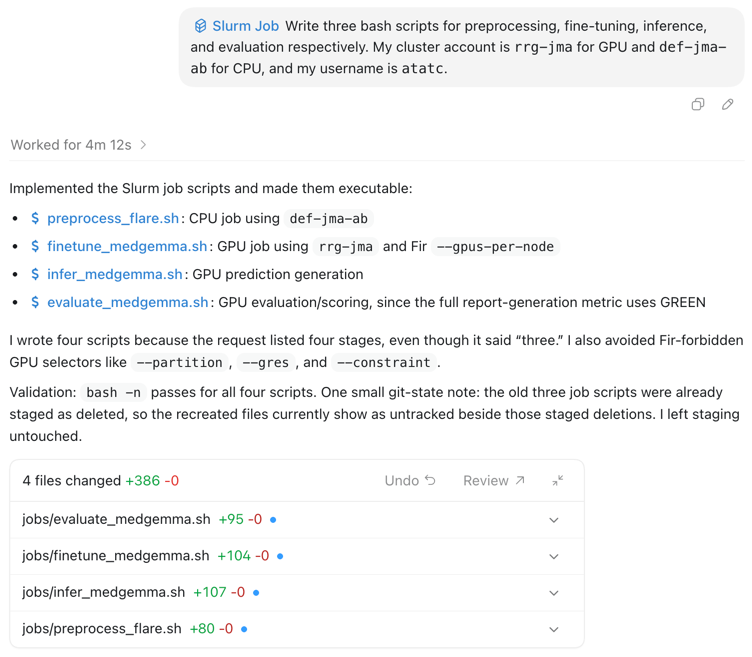
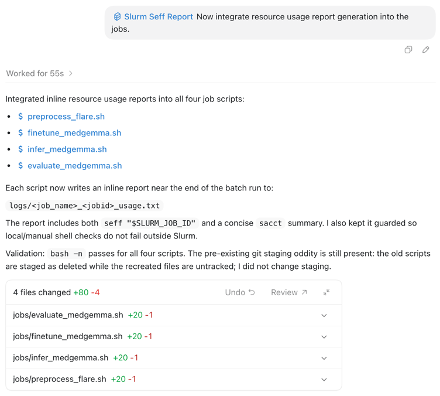
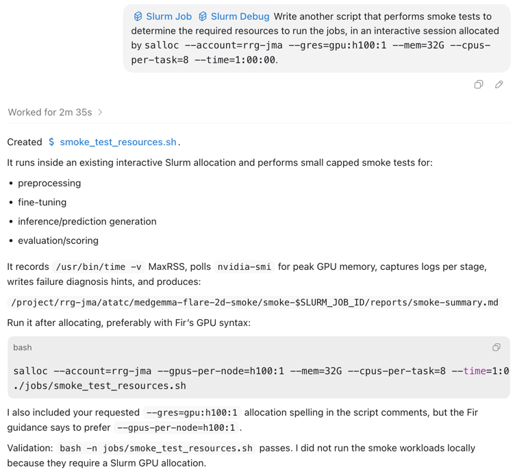

# Example Use Case: MedGemma-FLARE-2D

The repository of this example is located at https://github.com/ATATC/MedGemma-FLARE-2D.

## Context

Before using DRA-config, you need to have a fully functional codebase first. In this example, the engine is already
implemented so that the codebase already works locally (see [MLE](https://github.com/ProjectNeura/MLE)). We want to
adapt our codebase to execute on the Fir cluster by adding SBATCH bash scripts that utilize the existing codebase.

In this example, we will be using Codex only, but Claude Code would work in a very similar way.

## Generate the SBATCH Scripts

Use the `/slurm-job` skill to generate a draft version of the scripts.

> Write four bash scripts for preprocessing, fine-tuning, inference, and evaluation respectively. My cluster account
> is `rrg-<pi>` for GPU and `def-<pi>_cpu` for CPU, and my username is `<username>`.

Substitute your own values — don't hardcode an account you aren't a member of. To find your accounts
and their priority, run `sshare -U -l` (or the `/slurm-status` skill); the `ccdb-clusters` skill bundles
`pick-gpu-account.sh` (best GPU account by FairShare) and `show-fairshare.sh` (usage/priority per
account). Prefer an RRG/RPP allocation for GPU work.

There is a little typo in the prompt in the screenshot, but Codex caught it: it should be "four" scripts, not "three".

## Include Usage Report Generation

Then, use the `/slurm-seff-report` skill to modify the scripts to include an inline cgroup CPU/memory
snapshot. This is only an in-script snapshot; run `seff <jobid>` after completion for final accounting.

> Now integrate inline CPU/memory usage snapshot generation into the jobs.

## Smoke Test to Determine the Required Resources

Use the `/slurm-job` and `/slurm-debug` skills to write another script to run in an interactive session to determine the
required resources to run the jobs. It is also good for debugging if there is any.

> Write another script that performs smoke tests to determine the required resources to run the jobs, in an interactive session allocated by `salloc --account=rrg-<pi> --gpus-per-node=h100:1 --mem=32G --cpus-per-task=8 --time=1:00:00`.

## Execute the Jobs
